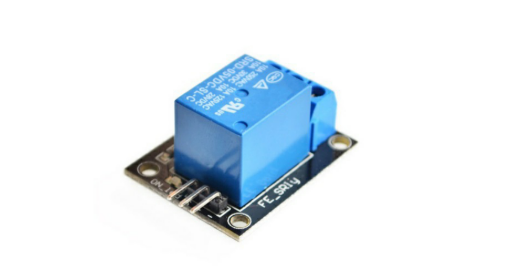

El módulo de relé conocido como KY 0 19. Este es un módulo en sí mismo. Este módulo está integrado a bordo. Uno llevó una resistencia Una dieta y un transistor. La resistencia que se usa en este módulo es de 150 M. Y la razón principal para usar la resistencia es limitar la clasificación de la moneda dentro del módulo. El LED se enciende para mostrar si el módulo está funcionando o no. Ahora, mostraré cómo estos componentes están conectados entre sí. Ahí tenemos el relé en sí y podemos ver el LED l uno, la resistencia r1, el transistor q1 y por supuesto, los diodos El de la derecha puedes ver como la pieza del módulo que conecté en esta placa, tenemos entrada el flujo del voltaje lo tenemos en negro, el flujo del suelo y por supuesto tenemos en verde el flujo de una señal. Los relés son interruptores que abren y cierran secretos electromecánica o electrónicamente. Los relés controlan un circuito eléctrico abriendo y cerrando contactos en otro circuito. Como muestran los diagramas de relés, cuando los contactos de un relé están normalmente abiertos, hay un relé de propietario de contacto abierto que no está energizado. Cuando el contacto del relé está normalmente cerrado, hay un contacto cerrado cuando no está energizado. En cualquier caso, la aplicación de corriente eléctrica al contacto cambiará su estado. los relés se utilizan generalmente


para cambiar jardines más pequeños en la consola para dejar de fumar y no suelen controlar los dispositivos que consumen energía. Ahora, los menos relés pueden controlar voltajes y emperadores más grandes al tener un efecto de amplificación debido a que se aplica algo de voltaje a la caja de la bobina de encaje en un voltaje grande que se conmuta mediante los contactos. Hablemos de los pines. Los pines de este módulo son tres, tenemos el pin de tierra con un signo menos, el pin de voltaje está en el medio. Y por supuesto tenemos el pin de la señal con el signo S. Así que hablemos de la señal. Este módulo toma una señal digital para que podamos conectar el dolor de la señal con cualquier puerto digital de diferentes placas de microcontroladores como Arduino o Raspberry Pi.

EXAMPLE SENSOR CODE:

``` 
int relay = 10; //Pin 10
void setup()
{
pinMode(relay,OUTPUT);
the port attribute as output
}
void loop()
{
digitalWrite(relay,HIGH);
relay ON
// [NO] is connected to feed
// [NC] is not connected to feed
delay(1000);
// turn the
// Define
digitalWrite(relay,LOW);
// turn
the relay OFF
// [NO] is not connected to feed
// [NC] is connected to feed
delay(1000);
``` 
