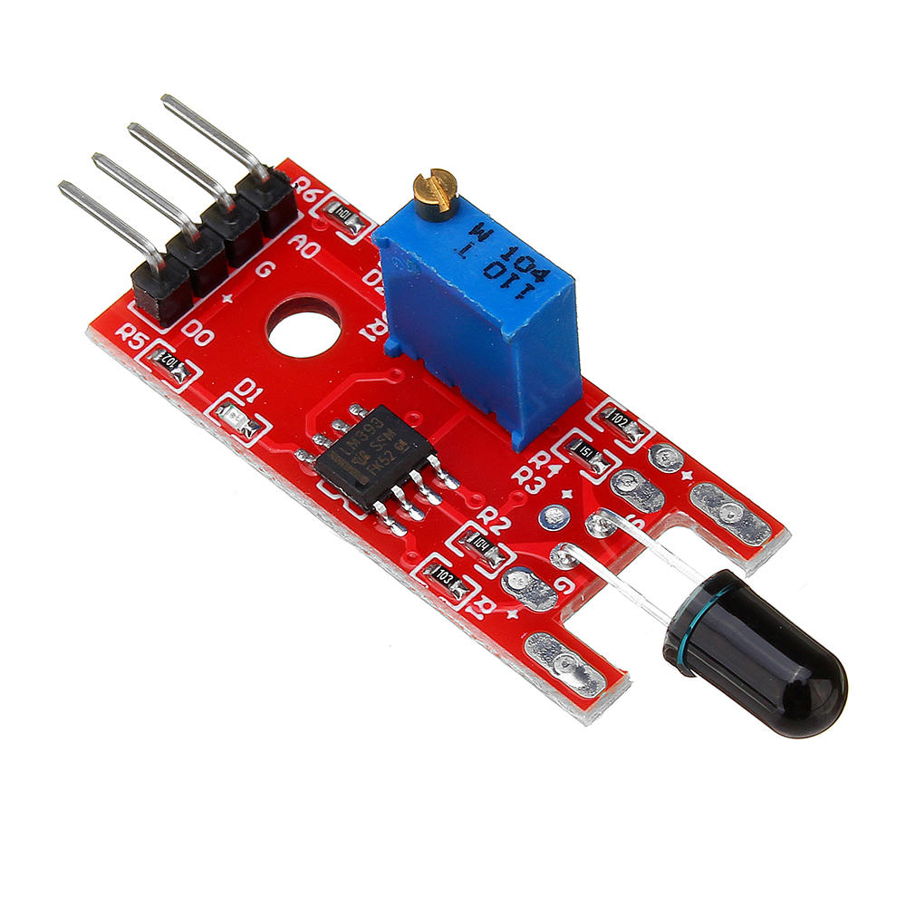
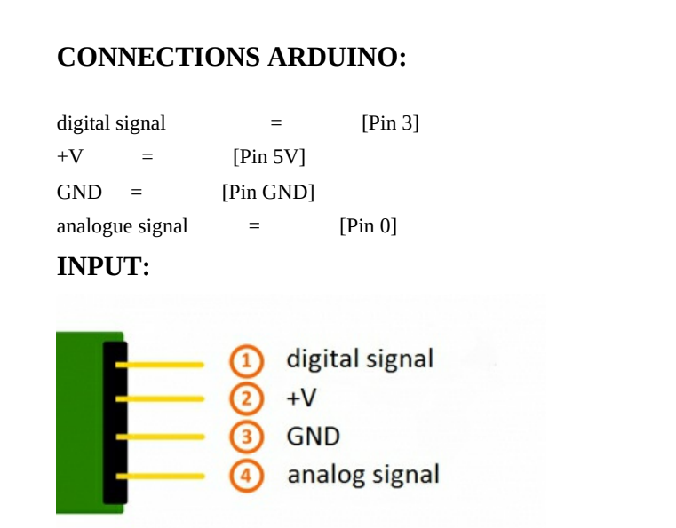

# DESCRIPTION
The flame sensor known KY 0 26. This is the module itself.
This module has integrated on board AI flame sensor, one
potentiometer one microchip 60 resistors and two led the resistor r1
used in this module is thank you ohms the resistor R two is 100 kilo
ohms. There is these there are three is 150 ohms, there is Easter r
four is one kilo on their resistor R five is Wankel arm and the resistor
R six is 100 kilo ohms

The main reason for using the resistor is to limit current circulating
inside the module. In other words, to prevent the current from
burning our module, the LED l one lights up to show if the module is
working properly or not. Now, I will show how these components
are connected together. There we have the sensor itself and of
course, the six resistors and the two LEDs on the right you can see
all the piece of the module icon on this board. We have in black, the
flow of the ground, we have in the red, the flow of the voltage, we
have in a light green, the flow of the analogueue signal and of course
we have in green, the flow of the digital signal the flame sensor is
used to detect fires or other light sources that have a wavelength of
760 nanometres to thousand hundred nanometres.
Near infrared ray flame detector, also known as a visual flame
detectors employ flame recognition technology to confirm fire by
analyzing near infrared radiation using a charge coupled device. A
near infrared sensor is especially able to monitor flame phenol Mia
without too much he drains from water or water vapor. Viral electric
sensor operating at this wavelength can be relatively cheap. Multiple
channel or big cell array sensor monitoring flames in the near

infrared band are arguably the most reliable technology vailable for
the detection of fires, light emission from a fire form an image of the
flame at a particular instant digital image processing can be utilized
to recognize flame through analyzes of a video created from the near
infrared images. This module can detect the flame, but can also take
the usual light.
The sensitivity of this sensor is adjustable and also has a stable
performance. These sensors are used for shorter range fire detection
as well. The sensor begins to detect flame at a distance of 0.8 meters.
If the flame intensity is high, the detection distress will increase Let's
talk about the pins. The pins in this module are four, we have the
ground pin with G sign, we have the voltage pin with the plus sign,
we have the analogue pin with a 0 sign. And of course we have the
digital pin with the 0 sign. So let's talk about the signal. This module
gives two signals, we can connect the pin of the analogue signal with
any analogue port and the pin of the digital signal with any digital
port of different microcontroller boards like Arduino or Raspberry
Pi.



## EXAMPLE SENSOR CODE:
```ARDUINO
int led = 13; // define the LED pin
int digitalPin = 2; // KY-026 digital interface
int analoguePin = A0; // KY-026 analogue interface
int digitalVal; // digital readings
int analogueVal; //analogue readings
void setup()

{
pinMode(led, OUTPUT);
pinMode(digitalPin, INPUT);
//pinMode(analoguePin, OUTPUT);
Serial.begin(9600);
}
void loop()
{
// Read the digital interface
digitalVal = digitalRead(digitalPin);
if(digitalVal == HIGH) // if flame is detected
{
digitalWrite(led, HIGH); // turn ON Arduino's LED
}
else
{
digitalWrite(led, LOW); // turn OFF Arduino's LED
}
// Read the analogue interface
analogueVal = analogueRead(analoguePin);
Serial.println(analogueVal); // print analogue value to serial

delay(100);

```
