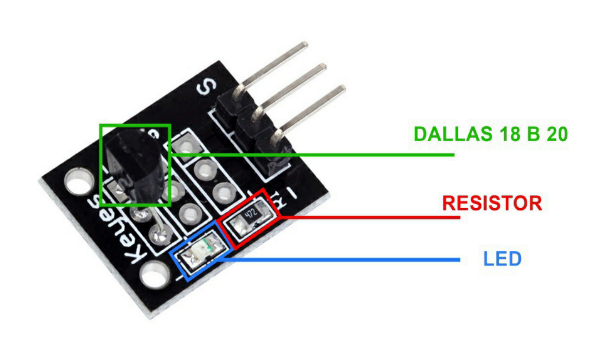
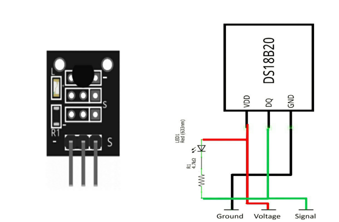

We're going to talk about the temperature sensor known as KY 001. This is a module itself So let's get started. 
This module has integrated
input a temperature sensor called Dallas 18 B 20. With single bass
technology, a resistor and a led the resistor used in this module is 4.7
kilo ohm and the main reason for using their resistor is to low mid
current circulating inside the module.





In other words to prevent the current from burning our module that LED lights up to show is the module is working properly or not. Now, I will show how these components are connected together. There we have the sensor itself and of course, the LED light and 
there it is you Sir r1 on third itube To see how the pins of the modules are connected in this board. So, we have internet the flow of the voltage in black with the flow of ground. And in green the flow of the sign of this module it is yours to measure the temperature with a sensor like Dallas d s 18 b 20, who has a temperature range from minus 55 gates Celsius to plus 125 gauge Celsius or minus 67 grades Fahrenheit to 257.



EXAMPLE SENSOR CODE:

```
#include <OneWire.h> 
#include <DallasTemperature.h> 

// Data wire is plugged into pin 2 on the Arduino #define ONE_WIRE_BUS 2 

// Setup a oneWire instance to communicate with any OneWire devices (not just Maxim/Dallas temperature ICs) 

OneWire oneWire(ONE_WIRE_BUS); 

// Pass our oneWire reference to Dallas Temperature. DallasTemperature sensors(&oneWire); 

void setup(void) 

{ 
// start serial port
Serial.begin(9600); 
Serial.println("Dallas Temperature IC Control Library Demo"); // Start up the library 
sensors.begin(); // IC Default 9 bit. If you have troubles consider upping it 12. Ups the delay giving the IC more time to process the temperature measurement 
} 
void loop(void) 
{ 
// call sensors.requestTemperatures() to issue a global temperature // request to all devices on the bus 
Serial.print("Requesting temperatures..."); 
sensors.requestTemperatures(); // Send the command to get temperatures 
Serial.println("DONE"); 
Serial.print("Temperature for Device 1 is: "); 
Serial.print(sensors.getTempCByIndex(0)); // Why "byIndex"? You can have more than one IC on the same bus. 0 refers to the first IC on the wire 
```
